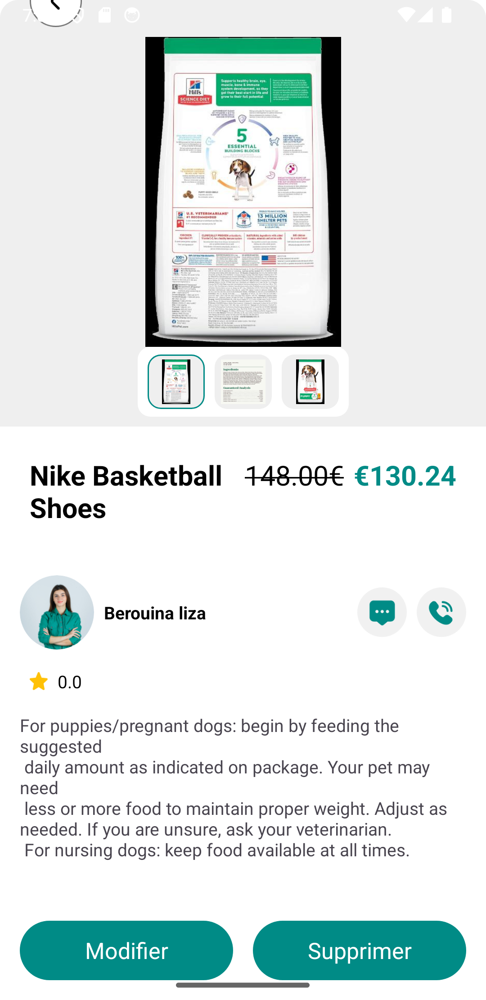
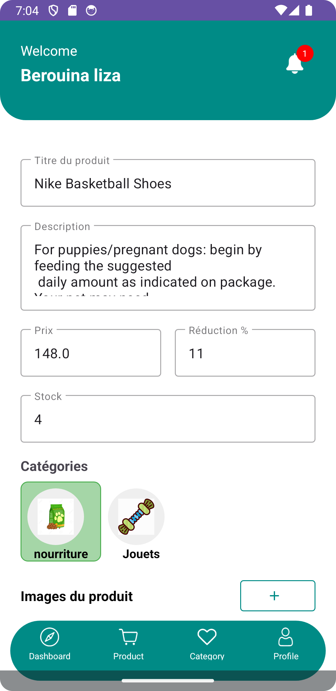
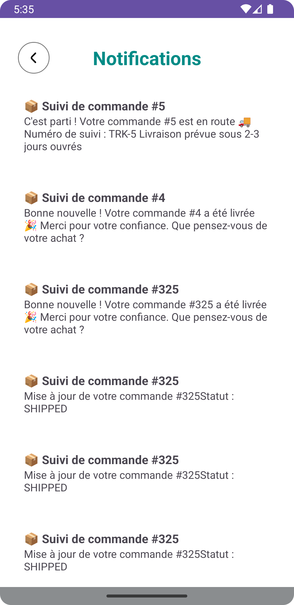
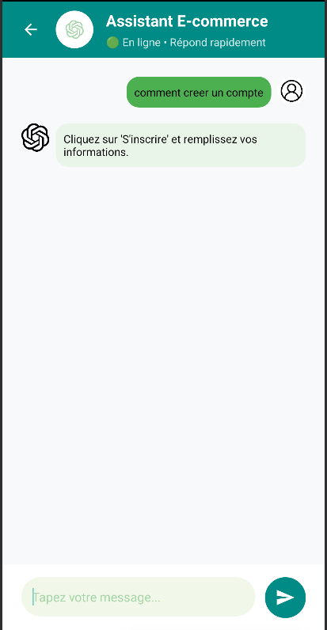

# 🛍️ ShopEase – Application Mobile de E-Commerce Personnalisée

ShopEase est une application mobile de e-commerce permettant aux utilisateurs d’**acheter** et de **vendre** des produits en toute sécurité, tout en profitant d’une **expérience fluide, intelligente et personnalisée**.

Elle intègre un moteur de **recommandation basé sur l’IA** pour suggérer des produits selon les préférences des utilisateurs, un **système de paiement sécurisé**, ainsi qu’un **suivi en temps réel des commandes**.

---

## ✨ Fonctionnalités Clés

### 🗂️ 1. Gestion des produits et catalogue
- Navigation intuitive par catégories.
- Recherche avancée avec filtres (prix, popularité, promotions...).
- Ajout de produits avec description, prix et images (pour les vendeurs).

### 👥 2. Gestion des utilisateurs (Clients & Vendeurs)
- Inscription et connexion sécurisées (email / réseaux sociaux).

### 🛒 3. Panier d’achat & Commandes
- Ajout, suppression et modification de produits dans le panier.
- Calcul automatique des prix, promotions et frais de livraison.
- Suivi des commandes avec historique, validation, et notifications push.
- Choix du mode de livraison.
- Intégration de paiement sécurisé.

### ⭐ 4. Avis et Notation
- Laisser des avis/notes sur les produits.
- Voir les recommandations et retours d'autres acheteurs.

---

## 📱 Captures d’écran de l’application

  
  
  
  
  
  
  
  

